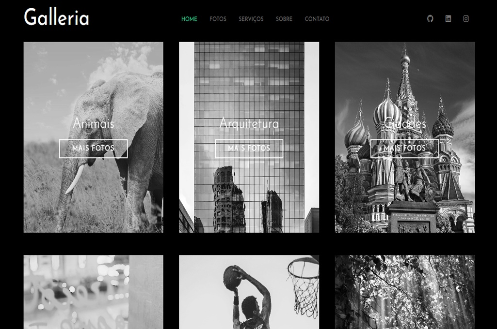

# Galleria

Link do site: https://kaiocesarnp.github.io/galleria

Site estruturado em HTML e estilizado com SASS/CSS.

Fotos em preto e branco. Ao passar o mouse por qualquer uma, sua cor original surge e ao tirar o mouse, voltam ao estado programado. Ao clicar em "mais fotos", o usuário é guiado à página pexels.com, um site com fotos e vídeos profissionais livres de royalties.

